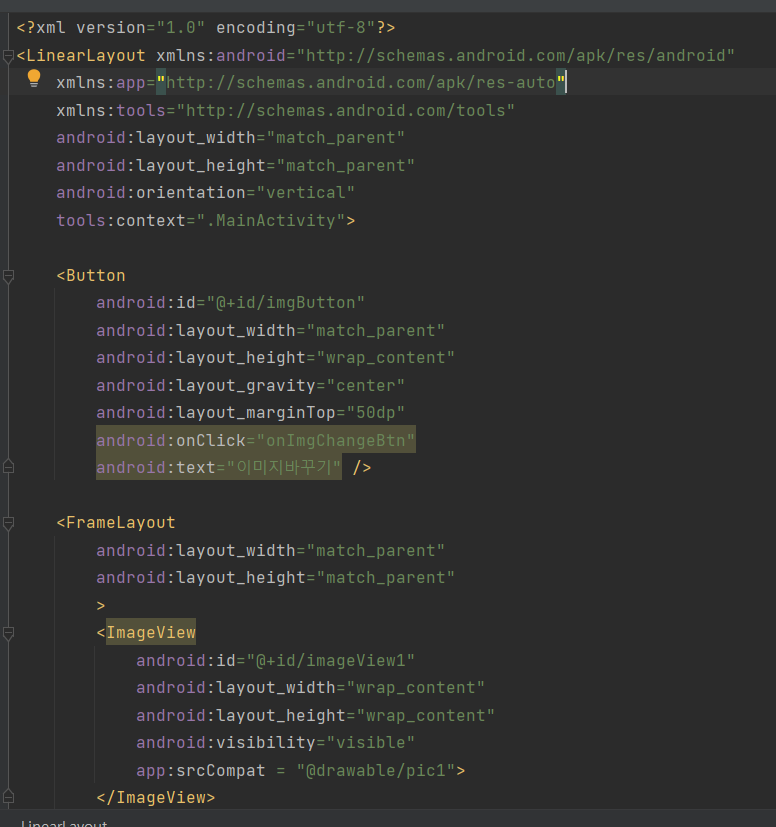
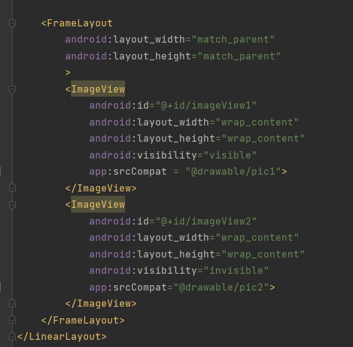
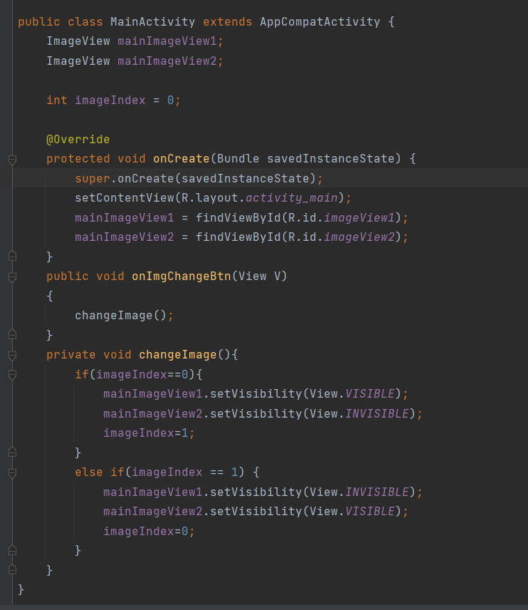
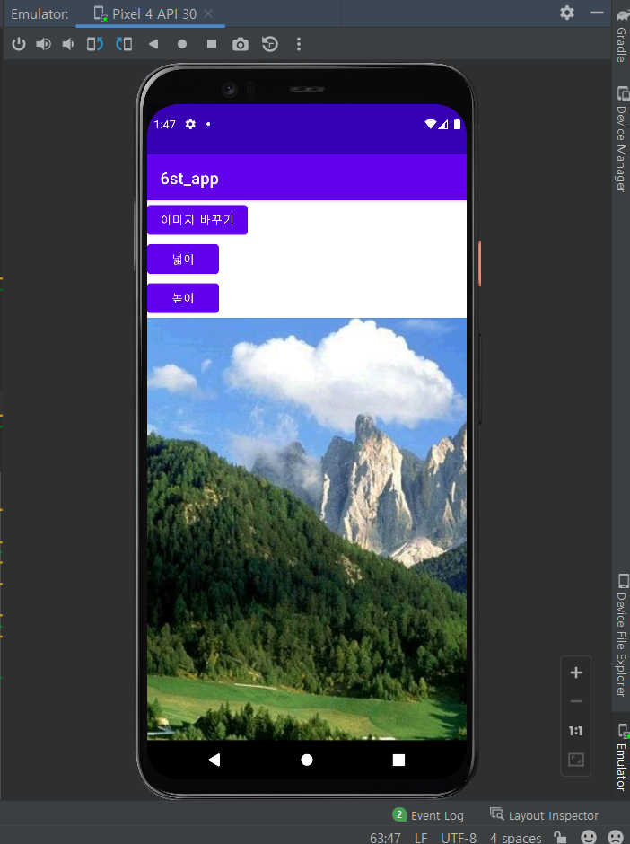
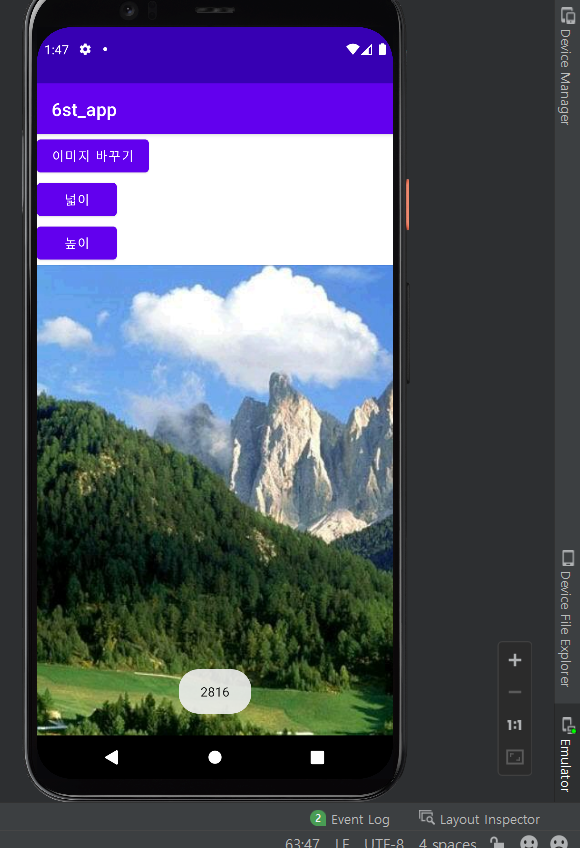
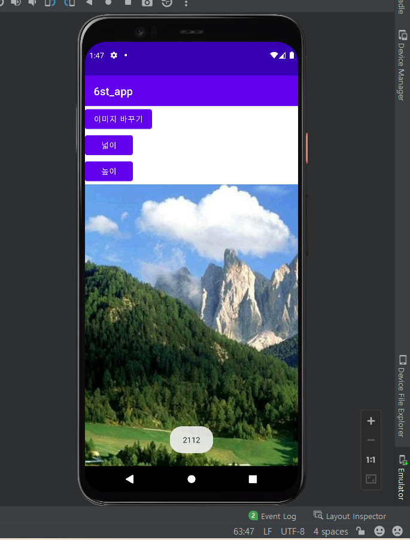
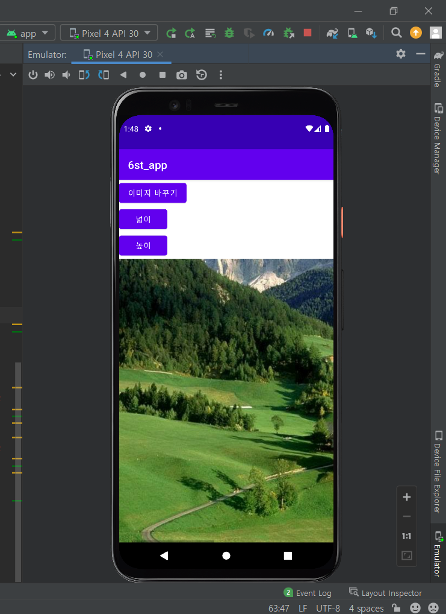
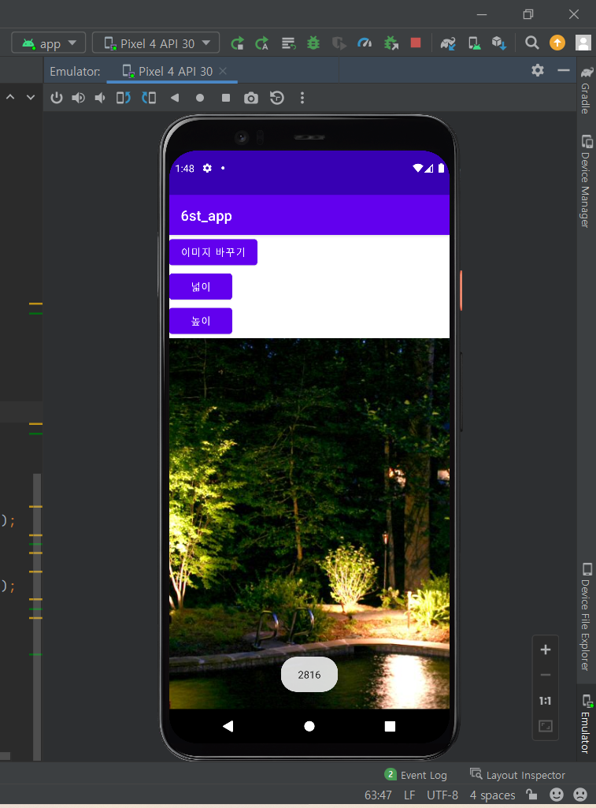
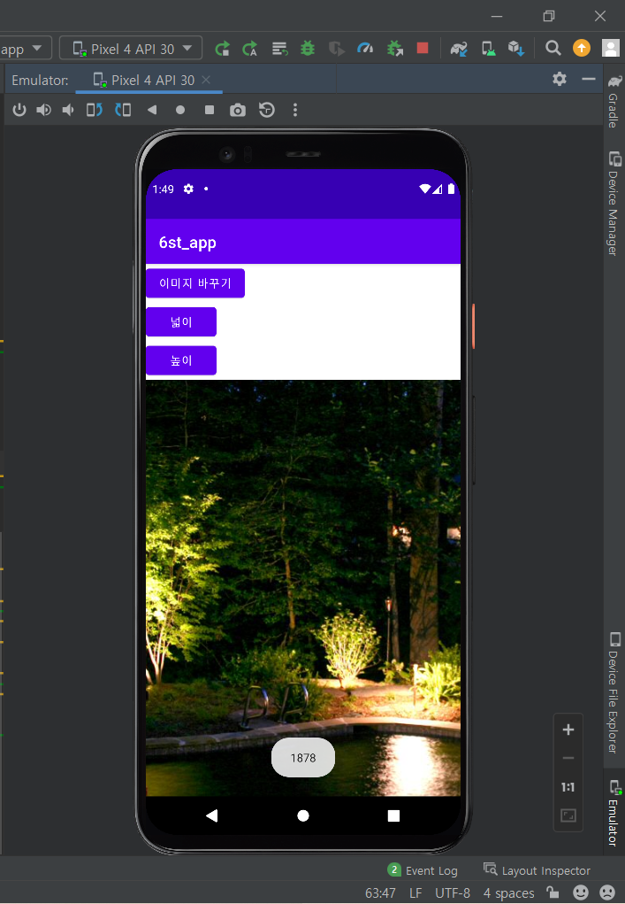

# 2주차(2022-03-15)
- 안드로이드 스튜디오 설치함

# 3주차(2022-03-22)
- 버튼으로 웹사이트 접속과 전화걸기 실습함 

# 4주차(2022-03-29)
- 학번과 이름 나타나게 버튼으로 실습함.

# 5주차(2022-04-06)
- 레이아웃을 이용한 이미지 바꾸기 실습함.

  - 소스 화면

# 6주차(2022-04-12)
- 지난주의 이미지 바꾸기에 스크롤뷰를 추가함.
  -시작 화면

    -image01의 높이, 넓이

    -image01의 스크롤뷰

   -image02의 높이, 넓이

